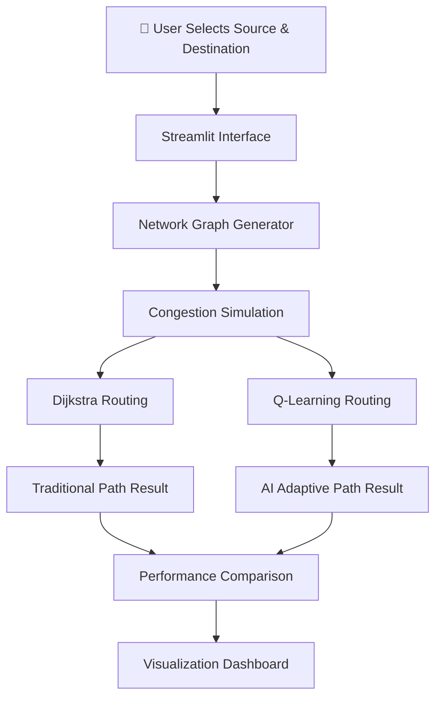

<div align="center">

# 🤖 NetRouteAI

### AI vs Traditional Network Routing Simulator

**An interactive routing simulator that compares classical shortest-path routing (Dijkstra) with AI-based adaptive routing (Q-Learning) in dynamic networks with congestion.**
*Visualize how reinforcement learning adapts to network changes in real time.*

<br>

[](https://www.python.org/)
[](https://streamlit.io/)
[](https://networkx.org/)
[](https://matplotlib.org/)
[]()
[]()

</div>

---

# 📖 What is NetRouteAI?

NetRouteAI is an **interactive AI network routing simulator** that demonstrates the difference between **traditional deterministic routing algorithms** and **adaptive AI-driven routing methods**.

The simulator compares:

* **Dijkstra’s Shortest Path Algorithm** (traditional routing)
* **Q-Learning Reinforcement Learning** (AI-based adaptive routing)

The system allows users to simulate **network congestion**, observe how routing decisions change, and visualize the performance difference between both approaches.

This project serves as both a **technical networking simulation** and an **educational reinforcement learning demonstration**.

---

# ✨ Features

| Feature                            | Description                                   |
| ---------------------------------- | --------------------------------------------- |
| 🌐 **Network Topology Simulation** | Interactive 6-node network graph              |
| 📊 **Traditional Routing**         | Shortest path using Dijkstra’s algorithm      |
| 🤖 **AI Routing**                  | Adaptive routing using Q-Learning             |
| 🚦 **Congestion Simulation**       | Network links can dynamically increase cost   |
| 📈 **Training Visualization**      | Progress bar shows AI learning progress       |
| 📉 **Performance Comparison**      | Compare routing cost and path efficiency      |
| 🎮 **Interactive Controls**        | Configure source, destination, and congestion |

---

# 🏗️ System Architecture

### Routing Simulation Pipeline



---

# ⚙️ How It Works

The simulator compares **two routing approaches**.

---

### 🔄 Traditional Routing (Dijkstra)

Dijkstra’s algorithm:

* Computes shortest path using **fixed edge weights**
* Does **not adapt to network congestion**
* Always produces the **same deterministic route**

Example behavior:

```
A → B → D → F
```

Even if congestion appears later, the algorithm still prefers the same path unless weights are manually updated.

---

### 🧠 AI Routing (Q-Learning)

The AI router learns routing behavior through **reinforcement learning**.

Key concepts:

* **State** → Current network node
* **Action** → Choose next neighbor node
* **Reward** → Negative cost for longer paths
* **Goal** → Reach destination with minimum cost

The algorithm improves over multiple episodes using:

* **Exploration (ε-greedy)**
* **Reward shaping**
* **Q-value updates**

Eventually, the AI learns routes that **avoid congested links dynamically**.

---

# 🛠️ Technology Stack

### Core System

| Component            | Technology   |
| -------------------- | ------------ |
| Programming Language | `Python`     |
| Web Interface        | `Streamlit`  |
| Graph Simulation     | `NetworkX`   |
| Visualization        | `Matplotlib` |

---

### AI & Algorithms

| Algorithm       | Purpose                           |
| --------------- | --------------------------------- |
| Dijkstra        | Traditional shortest-path routing |
| Q-Learning      | Reinforcement learning routing    |
| ε-Greedy Policy | Exploration vs exploitation       |
| Reward Function | Cost-based path optimization      |

---

# 📂 Project Structure

```text
ai-routing-simulator/
│
├── app.py             # Streamlit simulator application
└── requirements.txt   # Python dependencies
```

A minimal structure designed for **simplicity and fast deployment**.

---

# 🚀 Installation & Setup

### Prerequisites

* Python 3.8+
* pip

---

## 1️⃣ Install Dependencies

```bash
pip install -r requirements.txt
```

---

## 2️⃣ Run the Simulator

```bash
streamlit run app.py
```

---

## 🌐 Local Application

Open the browser at:

```
http://localhost:8501
```

---

# 🧭 Usage Guide

### Step 1 — Select Nodes

Choose:

* Source node
* Destination node

---

### Step 2 — Add Network Congestion

You can:

* Use **predefined congestion scenarios**
* Manually congest specific edges

Congested links increase cost.

---

### Step 3 — Run Traditional Routing

Click:

```
Find Traditional Path
```

Outputs:

* Shortest path
* Total cost
* Network visualization

---

### Step 4 — Train AI Router

Configure:

* Training episodes
* Exploration behavior

Then click:

```
Train AI & Find Path
```

Outputs:

* Adaptive routing path
* Learned path cost
* Training progress

---

### Step 5 — Compare Results

Use:

```
Compare Both Methods
```

The system generates a table comparing:

| Metric              | Traditional | AI       |
| ------------------- | ----------- | -------- |
| Path                | Static      | Adaptive |
| Cost                | Fixed       | Learned  |
| Congestion Handling | ❌           | ✅        |

---

# 🔧 Technical Details

### Network Topology

* Nodes: **A–F**
* Graph Type: Weighted graph
* Congested edges: **cost ×3**

---

### Q-Learning Parameters

| Parameter           | Value             |
| ------------------- | ----------------- |
| Learning Rate (α)   | 0.1               |
| Discount Factor (γ) | 0.9               |
| Exploration (ε)     | ε-greedy          |
| Episodes            | User configurable |

---

### Visualization

* **NetworkX graph rendering**
* **Red edges** → Congestion
* **Blue path** → Selected route

---

# 🎓 Educational Value

NetRouteAI is ideal for teaching:

* Computer Networking
* Reinforcement Learning
* Adaptive systems
* Algorithm comparison
* AI vs deterministic algorithms

It works well for:

* **AI coursework**
* **Networking labs**
* **Live classroom demonstrations**

---

# 👨‍💻 Author

**Kishore P**
AI & Full-Stack Developer
CSE (AI & Robotics) — VIT Chennai

---

<div align="center">

<br>

<i>Exploring the future of adaptive networking with AI.</i>

<br><br>

**NetRouteAI** — where reinforcement learning meets network routing.

</div>
